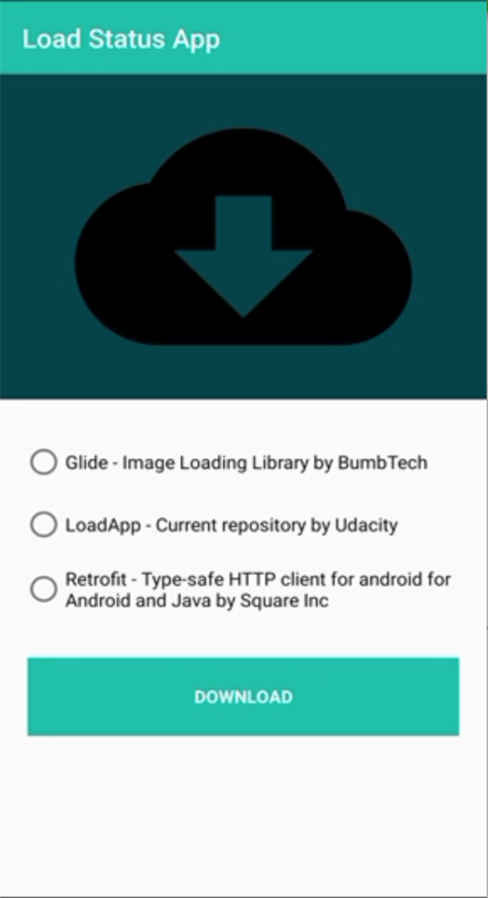
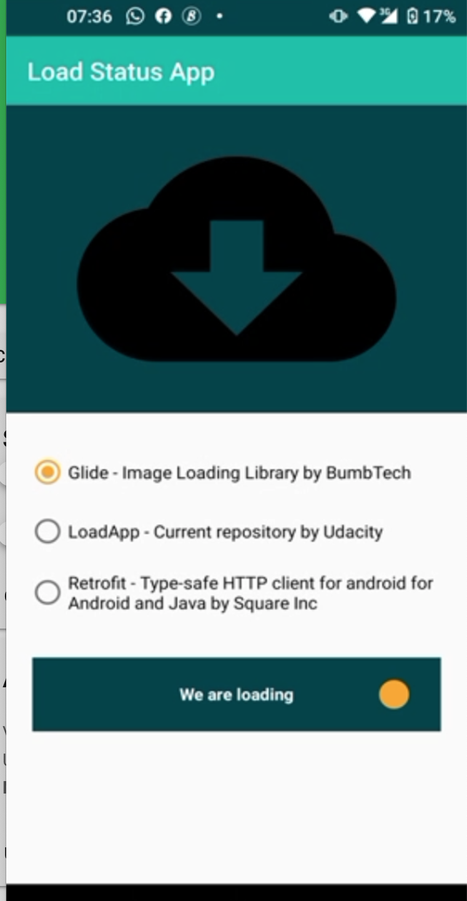
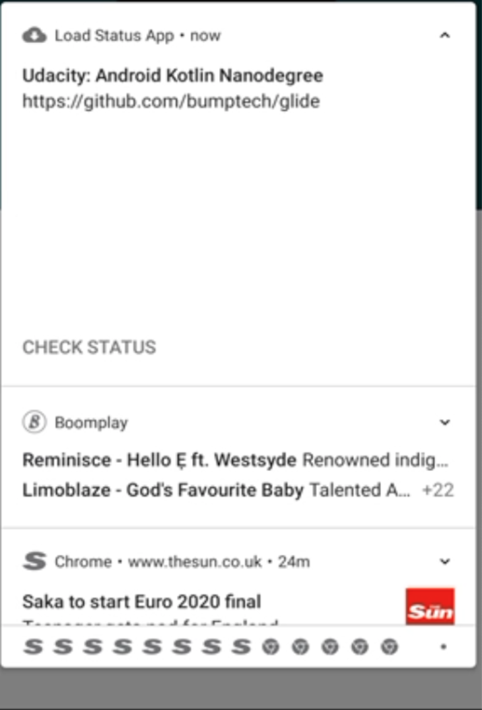
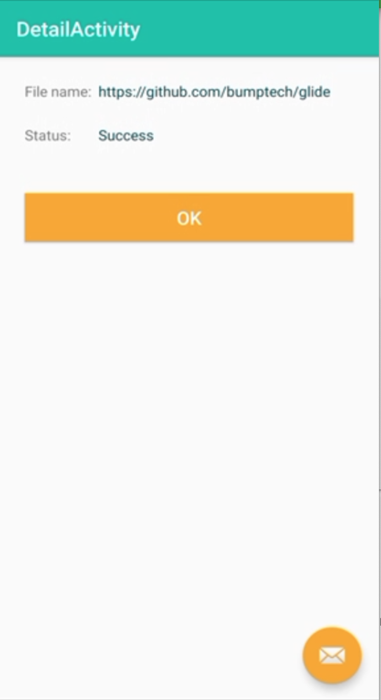

# Loader

Loader App is a custom view animated application used to dowload files and display download status.

_This is a custom application built and reviewed by Udacity Android Nanodegree Programme expert._


## Feature
* Kotlin Coroutine for async operations
* liveData an observable data holder class for lifecycle-aware task
* Koin for dependency injection
* Databinding to bind UI layout to data model
* Custom view button
* Motion layout for animation
* Notifcation status after download


## Get Started
**As this is an android project, you will need an android device to run the application**
_Instruction to run the project_
* Download and install lastest android studio on your device.
    - [Here](https://developer.android.com/studio) is the link to download the lastest version of android studio
* Clone the project repository by running the following command line on a terminal

    ```
    https://github.com/Ayodeji97/Loader.git
    
    ```
    
* Open project in android studio by clicking of File -> New -> Import project and choose the downloaded project
* Run the app

## Libraries
* [Kotlin Coroutine](https://developer.android.com/kotlin/coroutines)
* [LiveData](https://developer.android.com/topic/libraries/architecture/livedata)
* [DataBinding](https://developer.android.com/topic/libraries/data-binding)
* [ViewMOdel](https://developer.android.com/topic/libraries/architecture/viewmodel)
* [Motionlayout](https://developer.android.com/training/constraint-layout/motionlayout)
* [Notification](https://developer.android.com/training/notify-user/build-notification)
* [Androidx](https://developer.android.com/jetpack/androidx)
* [Navigation componenet](https://developer.android.com/guide/navigation)
* [custom view](https://developer.android.com/codelabs/advanced-android-kotlin-training-custom-views#0)
* [Timber](https://github.com/JakeWharton/timber)
* [Moshi](https://github.com/square/moshi)


# Screen Shots
<p float="left">
  
  
</p>

<p float="left">
      
    
</p>


# Author
**Daniel Ayodeji**

# License
This project is licensed under the Apache License 2.0 - see : https://www.apache.org/licenses/LICENSE-2.0.txt
